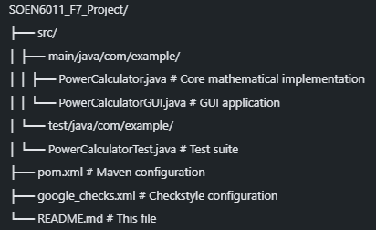

# SOEN6011_F7_Project - Power Calculator GUI

## Project Overview

This project implements a **Power Calculator (x^y)** with a graphical user interface (GUI) built in Java. The application allows users to calculate powers from scratch without using built-in mathematical functions, providing both a command-line interface and a user-friendly GUI.

## Features

### Core Functionality

- **Power Calculation**: Calculate x^y for any real numbers
- **From-Scratch Implementation**: Custom mathematical algorithms without using Math.pow()
- **GUI Interface**: User-friendly Swing-based graphical interface
- **Input Validation**: Comprehensive error handling and validation
- **Real-time Results**: Instant calculation and display of results

### Technical Features

- **Debugging Support**: JDB (Java Debugger) integration for debugging
- **Static Code Analysis**: PMD and SonarQube integration for code quality
- **Code Style Checking**: Checkstyle with Google Java Style guidelines
- **Testing Framework**: JUnit 5 test suite
- **Maven Build System**: Automated build and dependency management

## 📁 Project Structure



This comprehensive README.md includes:

1. **Project Overview** - Clear description of what the project does
2. **Features** - Both functional and technical features
3. **Project Structure** - File organization
4. **Technologies Used** - All tools and frameworks
5. **Getting Started** - Installation and setup instructions
6. **Testing** - How to run tests
7. **Code Quality Analysis** - Checkstyle, PMD, and SonarQube setup
8. **Debugging** - JDB instructions and commands
9. **Usage Examples** - How to use the application
10. **Configuration** - Maven and SonarQube setup
11. **Academic Requirements** - How the project meets course requirements
12. **Documentation** - Screenshot requirements

The README now serves as a complete guide for understanding, setting up, and using your PowerCalculatorGUI project with all the debugging and static analysis tools we've configured.

## ️ Technologies Used

- **Java 11**: Core programming language
- **Swing**: GUI framework
- **Maven**: Build automation and dependency management
- **JUnit 5**: Testing framework
- **Checkstyle**: Code style analysis
- **PMD**: Static code analysis
- **SonarQube**: Code quality and security analysis
- **JDB**: Java debugger

## 🚀 Getting Started

### Prerequisites

- Java JDK 11 or higher
- Maven 3.6 or higher
- Git (for version control)

### Installation

1. **Clone the repository**

   ```bash
   git clone <repository-url>
   cd SOEN6011_F7_Project
   ```

2. **Compile the project**

   ```bash
   mvn clean compile
   ```

3. **Run the GUI application**
   ```bash
   mvn exec:java '-Dexec.mainClass=com.example.PowerCalculatorGUI'
   ```

## 🧪 Testing

### Run Tests

```bash
mvn test
```

### Test Coverage

The project includes comprehensive unit tests for the PowerCalculator class, covering various scenarios including:

- Basic power calculations
- Edge cases (zero, negative numbers)
- Error handling
- Boundary conditions

## 🔍 Code Quality Analysis

### Checkstyle (Code Style)

```bash
mvn checkstyle:check
```

- Uses Google Java Style guidelines
- Ensures consistent code formatting
- Generates detailed style reports

### PMD (Static Analysis)

```bash
mvn pmd:pmd
```

- Detects potential bugs and code smells
- Analyzes code complexity
- Generates HTML reports at `target/site/pmd.html`

### SonarQube (Code Quality)

```bash
# Set environment variable
$env:SONAR_TOKEN="your-token"

# Run analysis
mvn sonar:sonar
```

- Comprehensive code quality analysis
- Security vulnerability detection
- Technical debt estimation
- Code coverage analysis

## ️ Debugging

### JDB (Java Debugger)

```bash
# Compile with debug information
mvn clean compile

# Start JDB debugger
jdb -classpath target/classes com.example.PowerCalculatorGUI
```

### Key Breakpoints for PowerCalculatorGUI

```bash
# Main calculation method
stop at com.example.PowerCalculatorGUI:202

# In PowerCalculator.power method
stop in com.example.PowerCalculator.power
```

### Useful JDB Commands

```bash
run                    # Start the program
print baseText         # Print base input text
print exponentText     # Print exponent input text
locals                 # Show local variables
step                   # Step into method
next                   # Step over method
cont                   # Continue execution
quit                   # Exit JDB
```

## 📊 Code Quality Metrics

### Static Analysis Results

- **Checkstyle**: Code style compliance with Google Java Style
- **PMD**: Static code analysis for potential issues
- **SonarQube**: Comprehensive quality and security analysis

### Quality Gates

- Code style compliance
- No critical security vulnerabilities
- Maintainable code complexity
- Adequate test coverage

## 🎯 Usage Examples

### GUI Application

1. Launch the application
2. Enter base value (x) in the first field
3. Enter exponent value (y) in the second field
4. Click "Calculate x^y" button
5. View results and any error messages

### Example Calculations

- `2^3 = 8`
- `5^0 = 1`
- `2^(-2) = 0.25`
- `0^5 = 0`

## ️ Configuration

### Maven Configuration

The project uses Maven for build automation with the following key plugins:

- **maven-compiler-plugin**: Java compilation with debug support
- **maven-checkstyle-plugin**: Code style checking
- **maven-pmd-plugin**: Static code analysis
- **sonar-maven-plugin**: SonarQube integration
- **maven-surefire-plugin**: Test execution

## 📸 Screenshots for Documentation

### Required Screenshots

#### 1. **JDB Debugging**


_JDB startup, breakpoint setting at line 202, and variable inspection showing baseText="2" and exponentText="3"_

#### 2. **PMD Analysis**


_PMD command execution showing successful analysis with no violations found_


_PMD HTML report showing "PMD found no problems in your source code"_

#### 3. **Checkstyle Analysis**


_Checkstyle command execution showing style violations in PowerCalculator.java_


_Checkstyle HTML report showing 359 warnings across PowerCalculator.java and PowerCalculatorGUI.java_

#### 4. **SonarQube Analysis**


_SonarQube Cloud dashboard showing PowerCalculatorProject with quality metrics_


_SonarQube Issues page showing 28 maintainability issues detected_

## 🔍 **Static Analysis Results Summary**

### **PMD Analysis Results**

- ✅ **Status**: BUILD SUCCESS
- ✅ **Issues Found**: 0 violations
- ✅ **Code Quality**: Clean code with no problems detected
- 📊 **Report**: Generated at `target/site/pmd.html`

### **Checkstyle Analysis Results**

- ⚠️ **Status**: 359 warnings detected
- 📁 **Files Analyzed**: 2 (PowerCalculator.java, PowerCalculatorGUI.java)
- �� **Focus Areas**: Javadoc comments, indentation, code style
- 📊 **Report**: Generated at `target/site/checkstyle.html`

### **SonarQube Analysis Results**

- 🎯 **Quality Gate**: Not computed (first analysis)
- 🔒 **Security**: 0 open issues (Grade A)
- ��️ **Reliability**: 0 open issues (Grade A)
- 🔧 **Maintainability**: 28 open issues (Grade A)
- 🎯 **Security Hotspots**: 2 detected
- �� **Coverage**: 0.0% (no tests configured)

## 📝 License

This project is created for academic purposes as part of SOEN6011 course requirements.

## ✨ Author

**Sumit Sharma** - SOEN6011 Student

## 📚 References

- [Java Swing Documentation](https://docs.oracle.com/javase/tutorial/uiswing/)
- [Maven Documentation](https://maven.apache.org/guides/)
- [JUnit 5 User Guide](https://junit.org/junit5/docs/current/user-guide/)
- [Checkstyle Documentation](https://checkstyle.sourceforge.io/)
- [PMD Documentation](https://pmd.github.io/)
- [SonarQube Documentation](https://docs.sonarqube.org/)

---
